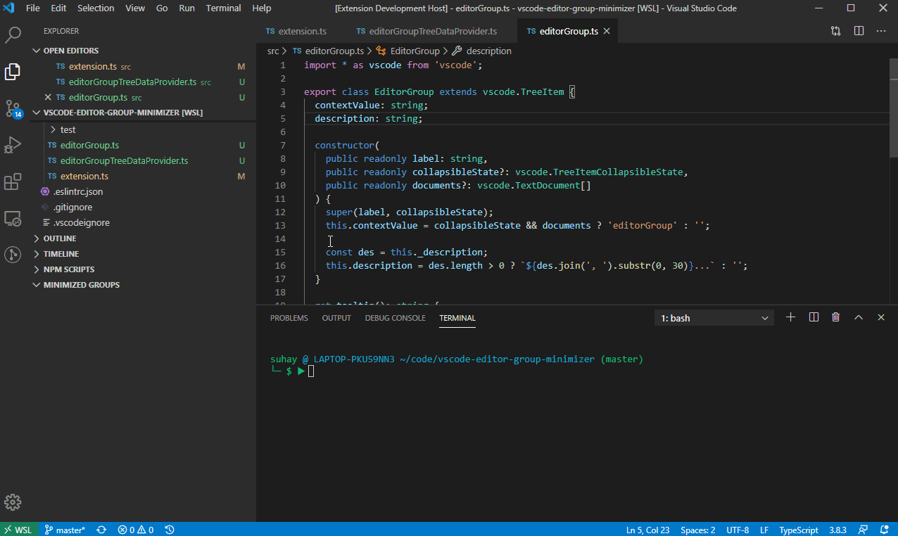

# Editor Group Minimizer

How many times have you been working on a feature with 20 different editor tabs open only to be derailed to work on a one off task or bug fix? You now have to decide:

1. Shove all your current tabs into a split editor, sacrificing window real estate because that split can never be fully minimized?
2. Try keeping your previous work separate from your current using a `README` as an ineffective boarder guard?
3. Start closing tabs out while telling yourself, "I'll remember where I was, this is fine!"

## Features

Quickly save a list of all open Editor tabs and place them into an easily managed view. From there, you can see a preview of the files, restore them back into tabs, or remove the reference list from the view. 

> Note: This does not save or edit the files within the list. It only saves, restores, and removes the references from the view. The files will remain untouched.

## Known Issues

 - VSCode doesn't support direct tab access via the API so options of what we can do is limited.

## Release Notes

### 1.0.3

- [Issue #3](https://github.com/suhay/vscode-editor-group-minimizer/issues/3): Not saving all tabs

### 1.0.2

- Bugfix

### 1.0.1

- Fixing packaging bug.

### 1.0.0

- Initial release.
